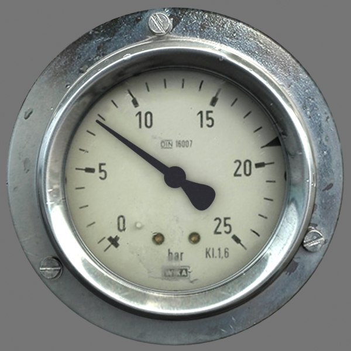
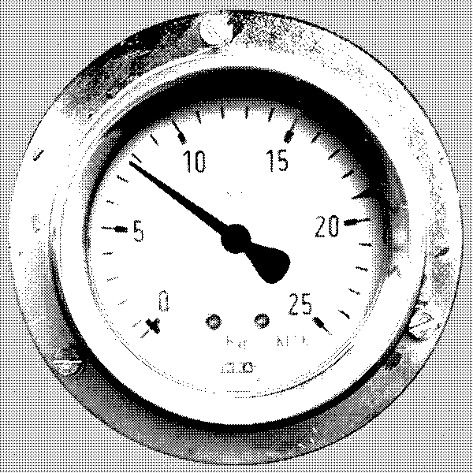

# Sharp.js dithering in Node

This simple test implements a B/W bayer filter, accessing the Buffer data supplied by Sharp. the index file is easily transportable into a larger project or pipeline, and makes few assumptions beyond what is necessary.

Normalization, output format and the like can be swapped. As the original goal was absolute file size reduction (without atrocious JPEG / webp artefacting), this output format stuck. Original inspiration comes from solar.lowtechmagazine.com

```bash
# install
$ npm install
# run
$ npm start [inputfile]
```

---



compared with


